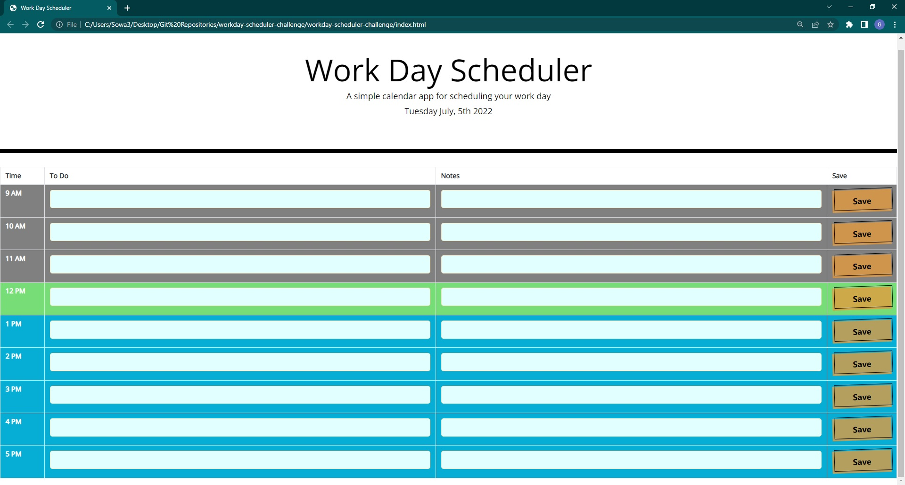

# workday-scheduler-challenge

## Table of Contents

- [Description](#description)
- [Installation](#installation)
- [Credits](#credits)
- [Usage](#Usage)
- [Bugs](#Bugs)
- [Screenshots](#screenshots)

## Description

This project involved creating a simple scheduling interface that allows users to note workday "to-do's" and notate anything special about them to keep in mind.

- The motivation for creating this project was continuing to develop vanilla JavaScript skills while mixing in JQuery, Bootstrap, and moment.JS APIs in order to get a handle on the scope of what even a simple webpage uses.
- I built this project largely in order to continue to get practice with the skills we are working on in class. While much of the HTML was created for us in the starter code, I used Bootstrap in order to fill out the table and added some custom CSS (which we learned how to do this week) to overwrite aspects of the Bootstrapped elements that I wasn't entirely satisfied with. This project involved getting several different layers of JavaScript involved, including time documentation from moment.JS, JQuery, and browser local storage keys. The project's active result is a useful tool that allows a user to plan their work day by recording to-do's for the day and notes on any special steps they may want to take to complete the list item. There is a save button for each item that corresponds to the given row if the user would like to save that item in local storage to continue to later.
- This is a useful project in that it creates a page that users can track real-world essential information with. By being able to track what time of day it is via color coded rows, and being able to note essential information about projects that may be due or requiring work at that time, a user of this webpage can effectively manage time throughout their day. The page is also practical in that the user can return to it later with everything saved locally; no need to worry about their notes being lost.
- I learned just as much from this project as I did from the last one (trivia quiz). This project was interesting because it's challenges were fewer but more focused and contained than the last one. While the last project sprawled and part of the challenge was staying on task and focused on the most important challenges in getting it working properly, this project asked the developer to solve two primary issues: how to sync the rows background color with the time of day and how to properly develop local storage functionality so that a user could return to a page and come back to their data. Without either function, the page would lose a tremendous slice of its use case, so the developer needed to make sure that both aspects were fully fleshed out. I really learned the importance of having a focused usecase from working on this project, as there were a number of tempting features in my head that had I started to code would either not have worked properly due to inexperience or would have interfered with its intended usecase.

## Installation

- There is no specialized installation of third-party programs or data required to use this webpage. All functionality is built into the page itself via JavaScript, which changes the displayed HTML elements and allows for saving of data to the local storage container. The user can write to the page, come back, see their data, and keep track of the time of day and whether certain hours are in the past, present, and future without taking any special steps of their own.

## Usage

- Using this website is fairly straightforward. Once the page has loaded, the user will be greeted with a title and a date. That date will be the current day. The user will immediately see a list of hours ranging from 9am-5pm (the standard 8-hour workday) who's rows will be colored grey, blue, or green. If the row is grey, that indicates to the user that the hour of the row has already passed for the day. The same goes for blue if that hour is in the future (within the same day). If the row is green, that means that whatever the hour indicated by the row is happening live, right now, for the user. This time functionality is meant to give the user a simple, visualized way to see what tasks remain in their day and what tasks have already passed. The user may also enter data to the rows. There are two input columns: to do and notes. In the to do column, the user is invited to label the task that they have to do according to the hour. In the corresponding notes column, the user may enter anything that comes to mind about that task; common usecases may be particular challenges the task presents, people to work with or ask about the task, or parts of the task that are already complete.

## Bugs

- While there are no known "bugs" afflicting the page, functionality is far from perfect. Users should know:

- There is currently no traditional "delete" or "clear" button to clear items from local storage. In order to clear an input field, a user must delete the content present and save an empty field to return the row to "default."
- Each save button corresponds with its own row. This means that entering text on row 3 and clicking save on row 8 will not save the text in row 3. The user must click the corresponding button to the row in order to save their input.

## Screenshots

- 
